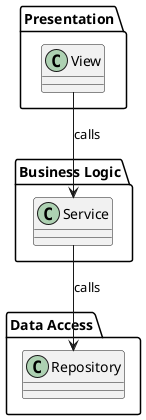

# 🏗️ ArchGuard: Neuro-Symbolic Referee for Architectural Drift Detection

## Project Vision

ArchGuard is an intelligent, interpretable system that detects and explains **architectural drift** in AI-generated code. It combines symbolic reasoning with neural language models to bridge the gap between static architectural specifications and runtime code implementations. Rather than simply flagging violations, ArchGuard generates natural language explanations and actionable code fixes for developers.

This graduate-level implementation combines graph theory, abstract syntax tree analysis, constraint satisfaction, and large language models into a unified pipeline that acts as a rigorous, yet empathetic code referee.

---

## The Neuro-Symbolic Architecture

ArchGuard implements a four-phase deterministic pipeline that transforms architectural rules into developer-friendly guidance:

### **Phase 1: Symbolic Brain** 🧠
*Parse Architecture → Build Rule Base*

The symbolic brain reads a PlantUML architecture specification and converts it into a formal, queryable graph representation:

- **Input**: PlantUML text file defining system layers, classes, and allowed dependencies
- **Processing**:
  - Parse PlantUML syntax to extract architectural components
  - Identify layers, classes, and their relationships
  - Define allowed dependency pathways
- **Output**: NetworkX directed graph representing the absolute source of truth for architectural rules
- **Key Insight**: Architecture becomes data—a graph where edges represent permitted call chains

### **Phase 2: Code Abstraction** 📝
*Source Code → Extract Implementation Facts*

The code abstraction layer uses Tree-Sitter to parse actual source code and extract only the architectural facts:

- **Input**: Python or Java source code (or entire repositories)
- **Processing**:
  - Parse source code using Tree-Sitter AST
  - Walk the AST to extract class definitions
  - Identify all explicit method-to-method calls
  - Track call sites with full source location information
- **Output**: NetworkX directed graph representing what the code actually does
- **Key Insight**: Implementation becomes data—another graph capturing real call relationships

### **Phase 3: Logic Engine** ⚙️
*Compare & Detect Violations*

The logic engine is a deterministic constraint satisfaction algorithm that serves as the referee:

- **Input**: Architecture graph (Phase 1) + Implementation graph (Phase 2)
- **Processing**:
  - Traverse every edge in the implementation graph
  - Check if each call is allowed by the architecture graph
  - For violations, generate a detailed call trace showing the violation path
  - Categorize violation types (direct, transitive, etc.)
- **Output**: Structured JSON violation traces with full context
- **Key Insight**: Violations are not vague—each includes the exact call chain that breaks the rules

### **Phase 4: Neuro-Symbolic Handoff** 🤖
*JSON Violations → Natural Language Explanations*

The final phase sends rigorous logical errors to Google Gemini for human-friendly translation:

- **Input**: JSON violation traces from Phase 3
- **Processing**:
  - Convert each violation into a detailed prompt for the LLM
  - Include architectural rules, violation details, and code context
  - Query Google Gemini API for natural language explanations
  - Extract LLM-generated code fix suggestions
- **Output**: Natural language explanations + suggested code fixes
- **Key Insight**: Logic guides the explanation—the LLM interprets, not decides

---

## The Problem This Solves

AI systems like ChatGPT and Claude can generate code that works, but often violates intended architectural patterns. A system following a layered architecture might generate a view layer that directly accesses the database, a service that bypasses its facade, or circular dependencies that shouldn't exist. Traditional linters catch syntax errors; ArchGuard catches *semantic* architectural errors.

ArchGuard provides:
- **Automated drift detection** without manual code review
- **Explainability** through natural language descriptions
- **Actionability** through concrete code fix suggestions
- **Rigor** through deterministic symbolic logic
- **Flexibility** through integrated AI interpretation

---

## Tech Stack

| Component | Technology | Why |
|-----------|-----------|-----|
| **Language** | Python 3.10+ | Mature ecosystem, excellent for AST manipulation |
| **Graph Engine** | NetworkX | Standard for architectural graph modeling |
| **Code Parsing** | Tree-Sitter | Language-agnostic, incremental parsing, robust AST |
| **AI/LLM** | Google Generative AI (Gemini) | State-of-art models, accessible API, no local infra |
| **Testing** | Pytest | Industry standard, excellent fixture/parametrization support |
| **Build/Package** | setuptools + wheels | Standard Python packaging approach |

---

## Key Features

✅ **Architectural Specification Language**: Parse rich PlantUML architecture diagrams
✅ **Multi-Language Support**: Extract facts from Python code (Java planned for Phase 2)
✅ **Deterministic Validation**: Constraint satisfaction engine guarantees consistent results
✅ **Violation Tracing**: Every violation includes the complete call chain that caused it
✅ **LLM Integration**: Google Gemini transforms logical errors into explanations
✅ **Modular Design**: Each phase is independently testable and extensible
✅ **Production Ready**: Type hints, comprehensive testing, clean architecture

---

## Project Structure

```
ArchGuard/
├── src/archguard/              # Main source package
│   ├── phase1_symbolic_brain/  # Architecture parsing and rule base
│   ├── phase2_code_abstraction/# Code extraction and implementation graph
│   ├── phase3_logic_engine/    # Violation detection and tracing
│   ├── phase4_neuro_symbolic/  # LLM integration for explanations
│   ├── common/                 # Shared utilities and exceptions
│   └── core.py                 # Main orchestrator facade
├── tests/                      # Comprehensive test suite
│   ├── unit/                   # Unit tests for each phase
│   ├── integration/            # Cross-phase integration tests
│   ├── e2e/                    # End-to-end pipeline tests
│   └── fixtures/               # Test data and sample files
├── docs/                       # Documentation
└── examples/                   # Example architectures and code
```

---

## Installation

### Prerequisites
- Python 3.10 or higher
- pip or uv package manager
- Git

### Quick Start

```bash
# Clone the repository
git clone <repository-url>
cd ArchGuard

# Create virtual environment
python -m venv venv
source venv/bin/activate  # On Windows: venv\Scripts\activate

# Install package in development mode
pip install -e ".[dev]"

# Run tests to verify installation
pytest tests/ -v
```

### Dependencies

Core dependencies:
- `networkx>=3.0` - Graph algorithms and structures
- `tree-sitter>=0.20` - AST parsing
- `google-generativeai>=0.3.0` - Gemini LLM integration

Development dependencies:
- `pytest>=7.0` - Testing framework
- `pytest-cov` - Coverage reporting
- `mypy` - Static type checking
- `pylint` - Code linting
- `black` - Code formatting

---

## Usage

### Basic Pipeline

```python
from archguard.core import ArchGuard

# Initialize the referee
referee = ArchGuard()

# Load architecture specification
architecture_path = "examples/sample_architecture.puml"
referee.load_architecture(architecture_path)

# Analyze source code
code_path = "examples/sample_code.py"
violations, explanations = referee.analyze(code_path)

# Get results
for violation in violations:
    print(f"Violation: {violation.type}")
    print(f"From: {violation.source_class}")
    print(f"To: {violation.target_class}")
    print(f"Explanation: {violation.explanation}")
    print(f"Suggested Fix: {violation.suggested_fix}")
```

### Individual Phases

```python
# Phase 1: Load and validate architecture
from archguard.phase1_symbolic_brain import PlantUMLParser, GraphBuilder

parser = PlantUMLParser()
architecture = parser.parse("architecture.puml")
graph = GraphBuilder.build_from_parsed(architecture)

# Phase 2: Extract code facts
from archguard.phase2_code_abstraction import CodeGraphBuilder, PythonExtractor

extractor = PythonExtractor()
code_graph = CodeGraphBuilder.build_from_code("source_code.py", extractor)

# Phase 3: Detect violations
from archguard.phase3_logic_engine import ConstraintChecker, TraceGenerator

checker = ConstraintChecker(architecture_graph, code_graph)
violations = checker.find_violations()
traces = TraceGenerator.generate_json_traces(violations)

# Phase 4: Get explanations
from archguard.phase4_neuro_symbolic import GeminiClient

client = GeminiClient(api_key="YOUR_API_KEY")
explanations = client.explain_violations(traces)
```

### Command Line Interface

```bash
# Analyze a single file
archguard analyze --architecture architecture.puml --code main.py

# Analyze entire repository
archguard analyze --architecture architecture.puml --code src/

# Output to JSON file
archguard analyze --architecture architecture.puml --code src/ --output violations.json

# Include LLM explanations
archguard analyze --architecture architecture.puml --code src/ --explain --api-key YOUR_API_KEY
```

---

## Development

### Running Tests

```bash
# Run all tests
pytest

# Run with coverage report
pytest --cov=src/archguard --cov-report=html

# Run only unit tests
pytest tests/unit/

# Run only integration tests
pytest tests/integration/

# Run with verbose output
pytest -v

# Run a specific test file
pytest tests/unit/test_phase1_symbolic_brain/test_plantuml_parser.py
```

### Code Quality

```bash
# Type checking
mypy src/archguard

# Linting
pylint src/archguard

# Code formatting (check)
black --check src/archguard

# Code formatting (apply)
black src/archguard
```

### Development Workflow

1. Create a feature branch: `git checkout -b feature/description`
2. Make changes in isolation (see Week 1-7 plan)
3. Write tests for your changes
4. Run full test suite and code quality checks
5. Commit with descriptive message
6. Push and create pull request

---

## Architecture Decisions

### Why NetworkX?
NetworkX provides mature, well-tested graph algorithms. Both architectural rules and implementation facts are naturally represented as directed graphs where nodes are classes and edges are call relationships.

### Why Tree-Sitter?
Tree-Sitter provides language-agnostic, incremental AST parsing with excellent error recovery. Unlike regex-based approaches, it handles complex syntax reliably. Its language plugins enable future extensions to Java, Go, Rust, etc.

### Why Not Type Stubs or Imported Symbols?
ArchGuard focuses on *explicit* architectural violations through *actual* method calls. Dynamic imports, reflection, and indirect invocations are out of scope initially—the goal is detecting clear violations, not runtime introspection.

### Why Four Phases?
1. **Separation of Concerns**: Each phase solves one problem cleanly
2. **Testability**: Each phase can be tested independently with mock inputs
3. **Extensibility**: Replace or enhance individual phases without affecting others
4. **Interpretability**: Output of each phase serves as documentation and verification

---

## Example

### PlantUML Architecture


### Violating Code
```python
class View:
    def load_data(self):
        # VIOLATION: View should not call Repository directly!
        repo = Repository()
        return repo.query()

class Service:
    pass

class Repository:
    def query(self):
        return data
```

### ArchGuard Output
```json
{
  "violations": [
    {
      "type": "DIRECT_VIOLATION",
      "source_class": "View",
      "target_class": "Repository",
      "violation_path": ["View.load_data", "Repository()"],
      "explanation": "The View layer should not directly access the Repository layer. All data access must go through the Service layer to maintain architectural separation of concerns.",
      "suggested_fix": "Create a Service method that wraps the repository call and have View call that instead."
    }
  ]
}
```

---

## Roadmap

### Current Phase
- ✅ Architecture and planning completed
- 🔄 **Week 1-7**: Core implementation (see detailed plan)

### Future Phases (Post-Week 7)
- Java code extraction support
- Additional language support (Go, Rust, TypeScript)
- Transitive dependency analysis
- Performance optimization for large codebases
- IDE plugin integration (VS Code, IntelliJ)
- Dashboard for violation visualization
- Integration with CI/CD pipelines

---

## Contributing

ArchGuard is a graduate-level project developed as part of an AI class. We welcome contributions that:
- Improve code clarity and maintainability
- Expand language support
- Enhance test coverage
- Improve documentation
- Add more sophisticated violation analysis

Please ensure all changes include:
- Corresponding unit tests
- Type hints throughout
- Clear commit messages
- Updated documentation

---

## Performance Considerations

- **Small Codebases** (<10K LOC): < 1 second per phase
- **Medium Codebases** (10K-100K LOC): 1-5 seconds per phase
- **Large Codebases** (>100K LOC): Scales linearly with code size; consider batch processing

Parsing is the fastest phase, constraint checking is deterministic O(E), LLM queries are the bottleneck (external API calls).

---

## Limitations

This implementation has intentional scope boundaries:

- ❌ Does not detect runtime violations or reflection-based calls
- ❌ Does not analyze indirect dependencies through configuration files
- ❌ Does not handle dynamic code generation
- ❌ Cannot reason about architectural intent beyond the PlantUML specification
- ❌ Requires explicit, well-formed PlantUML and source code

These limitations are by design—ArchGuard aims for *precision* and *interpretability*, not exhaustive coverage.

---

## Academic Context

ArchGuard is an implementation project for a graduate-level AI course. It demonstrates:
- **Symbolic AI**: Graph-based constraint satisfaction and reasoning
- **Neuro-Symbolic Integration**: Combining deterministic logic with neural language models
- **Software Engineering**: Modular design, comprehensive testing, clean architecture
- **Domain-Specific Problem Solving**: Applying AI techniques to real software engineering challenges

---

## License

[To be determined—typically MIT or GPL for academic work]

---

## Authors & Credits

**Primary Implementation**: Graduate AI Class Project, Spring 2025-2026

**Conceptual Inspiration**: Neuro-symbolic AI, architectural patterns, and software quality assurance literature

---

## Questions or Issues?

- 📖 Read the documentation in `/docs`
- 🧪 Check test examples in `/tests/fixtures`
- 📧 For questions or issues, please refer to project guidelines

---

**⭐ Built with architectural integrity and AI reasoning**